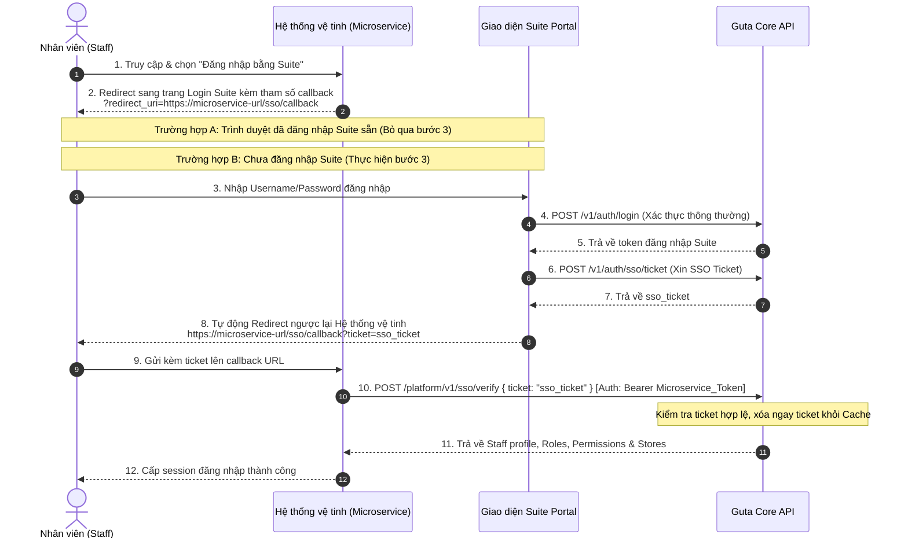

# Hướng dẫn Tích hợp Cơ chế Đăng nhập SSO Staff (Single Sign-On)

Tài liệu này cung cấp hướng dẫn chi tiết cách tích hợp đăng nhập một tài khoản Staff từ Suite Portal sang các hệ thống microservices vệ tinh khác sử dụng cơ chế SSO qua Ticket dùng 1 lần (Single-use ticket).

---

## 1. Quy trình Đăng nhập SSO (Luồng hoạt động)

Cơ chế SSO hỗ trợ 2 kịch bản điều hướng đăng nhập:

### 1.1. Kịch bản A: Đi từ ứng dụng Suite (Suite-initiated SSO)
Áp dụng khi Staff đang làm việc trên portal Suite chính và bấm nút chuyển hướng nhanh sang microservice vệ tinh.
1. **Suite Client (Web/App)** gọi API `POST /v1/auth/sso/ticket` lên Core để lấy một SSO ticket ngắn hạn (hạn 60s).
2. **Suite Client** điều hướng trình duyệt của Staff tới URL callback của Microservice kèm ticket đó: `https://microservice-url/sso/callback?ticket=sso_st_...`
3. **Microservice Backend** lấy `ticket` từ query param, gọi API `POST /platform/v1/sso/verify` (kèm theo API Token của microservice) tới Core để lấy thông tin chi tiết Staff.
4. **Microservice Backend** tạo session/token nội bộ cho Staff đó và hoàn tất đăng nhập.

### 1.2. Kịch bản B: Đi từ Hệ thống khác (Service Provider-initiated SSO)
Áp dụng khi Staff truy cập trực tiếp vào hệ thống vệ tinh trước, hệ thống này chưa có thông tin đăng nhập và muốn Staff đăng nhập bằng tài khoản Suite/Guta Staff.



#### Chi tiết các bước thực hiện ở Kịch bản B:
1. **Tại Hệ thống vệ tinh**: Khi Staff bấm nút "Đăng nhập bằng Suite", chuyển hướng trình duyệt của Staff tới trang đăng nhập tập trung của Suite kèm tham số `redirect_uri`:
   `https://suite.guta.vn/login?redirect_uri=https://microservice-url/sso/callback`
2. **Tại Giao diện Suite**:
   - Giao diện kiểm tra xem Staff đã đăng nhập trên trình duyệt này chưa.
   - Nếu đã đăng nhập, hoặc sau khi nhập tài khoản/mật khẩu đăng nhập thành công, Giao diện Suite gọi API `POST /v1/auth/sso/ticket` để lấy một SSO ticket.
   - Giao diện Suite thực hiện redirect trình duyệt của Staff quay trở lại `redirect_uri` đã nhận ở bước 1 kèm theo ticket trên query param:
     `https://microservice-url/sso/callback?ticket=sso_st_...`
3. **Tại Backend của Hệ thống vệ tinh**:
   - Nhận `ticket` từ query param, gọi API `POST /platform/v1/sso/verify` để nhận thông tin phân quyền của Staff và tạo phiên đăng nhập cho Staff.

---

## 2. Các API Endpoints liên quan

### 2.1. Sinh SSO Ticket (Suite Client gọi)
API này được bảo vệ bằng thông tin đăng nhập của Staff hiện tại.

*   **HTTP Method:** `POST`
*   **URL:** `/v1/auth/sso/ticket` (Hoặc `/suite/v1/auth/sso/ticket` tùy domain config)
*   **Headers bắt buộc:** `Authorization: Bearer <STAFF_PASSPORT_TOKEN>`
*   **Response thành công (200 OK):**
```json
{
  "success": true,
  "ticket": "sso_st_7fH3jK..._1789456200",
  "expires_in": 60
}
```

---

### 2.2. Xác thực SSO Ticket (Microservice Backend gọi)
API này dùng để verify ticket nhận được và lấy thông tin phân quyền của Staff.
*Lưu ý: Ticket chỉ được sử dụng tối đa 1 lần. Sau khi được gọi verify thành công, ticket sẽ lập tức bị xóa khỏi Cache của hệ thống để chống replay attack.*

*   **HTTP Method:** `POST`
*   **URL:** `/platform/v1/sso/verify`
*   **Headers bắt buộc:** `Authorization: Bearer <MICROSERVICE_PLATFORM_TOKEN>`
*   **Tham số Request Body (JSON):**
    *   `ticket`: (Bắt buộc) Chuỗi ticket nhận được từ client.

*   **Response thành công (200 OK):**
```json
{
  "success": true,
  "staff": {
    "id": 999,
    "username": "staff_sso_test",
    "name": "Nguyễn Văn Staff",
    "email": "staff.sso@guta.vn",
    "phone_number": "0901234568",
    "birthday": "1995-10-10",
    "gender": 1,
    "roles": ["admin"],
    "permissions": ["suite.access", "storereport.access"],
    "stores": [
      {
        "id": 5,
        "name": "Guta Coffee - Điện Biên Phủ",
        "code": "GUTA_DBP"
      }
    ]
  }
}
```

*   **Response thất bại do ticket sai hoặc hết hạn (400 Bad Request):**
```json
{
  "success": false,
  "message": "SSO Ticket không hợp lệ hoặc đã hết hạn."
}
```

---

### 2.3. Lấy danh sách Cửa hàng của Staff (Microservice Backend gọi)
API này dùng khi microservice muốn tải lại danh sách cửa hàng mới nhất mà Staff đó được phân quyền trên Core.

*   **HTTP Method:** `GET`
*   **URL:** `/platform/v1/staffs/{staff_id}/stores`
*   **Headers bắt buộc:** `Authorization: Bearer <MICROSERVICE_PLATFORM_TOKEN>`

*   **Response thành công (200 OK):**
```json
{
  "success": true,
  "stores": [
    {
      "id": 5,
      "brand_id": 1,
      "name": "Guta Coffee - Điện Biên Phủ",
      "code": "GUTA_DBP",
      "address": "123 Điện Biên Phủ, P.15, Bình Thạnh, TP. HCM",
      "store_hotline": "0901234567",
      "email": "dbp@guta.vn",
      "is_active": 1
    }
  ]
}
```
